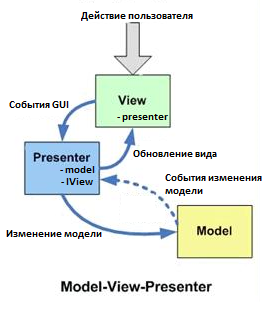

## Code refactoring
1. Use MVP pattern

## New feature
1. Game settings
    
    1.1. Choosing game difficulty level

    1.2. Change color themes

2. Add sounds of the game
3. Add starting view
4. Add closing view
